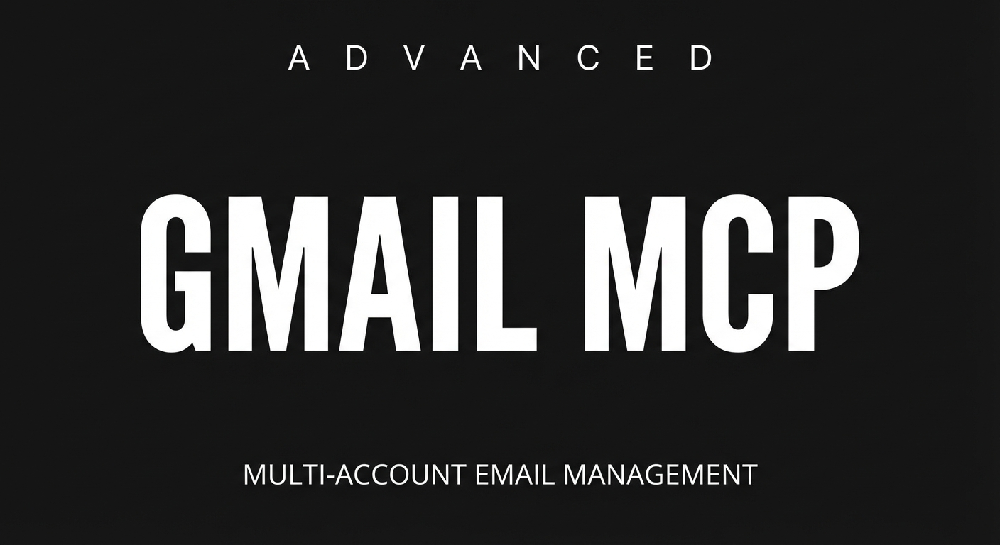

# Gmail MCP Server



A Gmail [MCP server](https://modelcontextprotocol.io) for [Claude Code](https://docs.anthropic.com/en/docs/claude-code) that provides full email management across multiple Gmail accounts.

## Features

- **51 tools** spanning Gmail (read, compose, draft management, modify, attachments, mailbox-change watching, thread and label management, mail rules and the vacation responder), Google Calendar, Google Drive (read plus upload), Google Docs (read plus append/find-replace), and read-only Google Chat — see the [Tools](#tools) table
- **Gmail-native outbound mail** — everything you send goes out as `multipart/alternative` (HTML plus a plain-text alternative), with your account's Gmail signature, quoted history on replies, and a proper `Name <address>` sender. Attachments supported on send, draft and reply; images can be embedded in the body with `inline_images` and referenced as `cid:filename`; forwards re-attach the original's files and keep its embedded images embedded
- **Watch for new mail without polling the whole inbox** — `get_history_baseline` hands you a cursor, `get_mail_changes` tells you what arrived, was deleted or was relabelled since it. Stateless: you keep the cursor
- **Multi-account** support with simple aliases
- **OAuth2** authentication with interactive CLI flow
- **Token auto-refresh** — re-authenticates transparently
- **Rate limit retry** with exponential backoff
- **Claude Code commands** included (`/email` and `/checkemail`) for structured inbox triage

## Quick Start

### 1. Clone & Install

```bash
git clone https://github.com/optiwork-ai/advanced-gmail-mcp.git
cd advanced-gmail-mcp
npm install
```

### 2. Google Cloud Setup

1. Go to [Google Cloud Console](https://console.cloud.google.com/)
2. Create a new project (or select an existing one)
3. Enable the APIs:
   - APIs & Services → Enable APIs → search "Gmail API" → Enable
   - For the Chat/Drive/Docs tools, also enable the **Google Chat API**, **Google Drive API**, and **Google Docs API**
   - For the Calendar tools, also enable the **Google Calendar API**
4. Configure the **OAuth consent screen**:
   - APIs & Services → OAuth consent screen
   - User type: External (or Internal if using Google Workspace)
   - Add your email address(es) as test users
   - Add scopes: `gmail.readonly`, `gmail.modify`, `gmail.send`, `gmail.compose`
   - For Chat/Drive/Docs, also add: `chat.spaces.readonly`, `chat.messages.readonly`, `drive.readonly`, `documents`, then re-run the auth flow for each alias (`npm run auth -- <alias>`) so the new scopes are granted
   - **`documents` replaced `documents.readonly` on 2026-08-28** so that `update_google_doc` can write. It covers reading too, so both Docs tools travel on the one grant — but every alias must re-consent before either works again
   - For Calendar, also add: `calendar.events`, `calendar.freebusy`, `calendar.calendarlist.readonly`
   - For `upload_drive_file`, also add: `drive.file` — the narrow Drive scope, which reaches only the files this server itself creates
   - For the mail-rule and vacation-responder tools, also add: `gmail.settings.basic`
5. Create **OAuth credentials**:
   - APIs & Services → Credentials → Create Credentials → OAuth client ID
   - Application type: **Desktop app**
   - Download the JSON file
6. Save the downloaded file as `credentials.json` in the project root

### 3. Configure Accounts

```bash
cp accounts.example.json accounts.json
```

Edit `accounts.json` with your Gmail accounts:

```json
{
  "accounts": [
    { "email": "you@gmail.com", "alias": "personal" },
    { "email": "you@company.com", "alias": "work" }
  ],
  "default": "personal"
}
```

You can add as many accounts as you want. Each needs a unique `alias`.

### 4. Authenticate

```bash
# Authenticate all accounts (opens browser for each)
npm run auth

# Or authenticate a single account
npm run auth -- work

# Check auth status
npm run auth:check
```

The auth flow opens a browser window for each account. Tokens are saved to `./tokens/`.

> **Adding a scope means re-consenting.** A token carries exactly the permissions that were granted when it was issued — editing the scope list does nothing to a token already on disk. **`documents` replaced `documents.readonly` on 2026-08-28**, so on any account authenticated before then, BOTH `get_google_doc` and `update_google_doc` answer 403 until that alias runs `npm run auth -- <alias>` again. **`drive.file` and `gmail.settings.basic` were added on 2026-08-27**, so on any account authenticated before then, `upload_drive_file`, `list_filters`, `create_filter`, `delete_filter`, `get_vacation` and `set_vacation` answer **403 until that alias runs `npm run auth -- <alias>` again**. Those tools say so in their own error messages. Everything else keeps working untouched in the meantime — nothing about sending, reading or the Gmail signature depends on the new grants.

### 5. Add to Claude Code

Add to your MCP config (project `.mcp.json` or `~/.claude.json`):

```json
{
  "mcpServers": {
    "gmail": {
      "type": "stdio",
      "command": "npx",
      "args": ["tsx", "/absolute/path/to/gmail-mcp/src/server.ts"]
    }
  }
}
```

> **Important:** Use the absolute path to `src/server.ts`.

### 6. (Optional) Add Commands

Copy the included Claude Code commands for structured email workflows:

```bash
# From your project root (where .claude/ lives)
mkdir -p .claude/commands
cp /path/to/gmail-mcp/.claude/commands/email.md .claude/commands/
cp /path/to/gmail-mcp/.claude/commands/checkemail.md .claude/commands/
```

Then use `/email` or `/checkemail` in Claude Code.

## Tools

| Tool | Description |
|------|-------------|
| `list_emails` | List inbox or label emails (50 per page, `page_token` for more) |
| `search_emails` | Search with Gmail query syntax (50 per page, `page_token` for more) |
| `read_email` | Read full email by ID |
| `get_thread` | Get full thread with all messages, bodies and attachment metadata |
| `get_labels` | List all labels (`include_counts` for message counts) |
| `get_history_baseline` | Get the mailbox's current change cursor (`historyId`) — the starting point for watching for new mail |
| `get_mail_changes` | What arrived / was deleted / was relabelled since a cursor you supply, plus the next cursor. No server-side state |
| `get_attachment` | Fetch an attachment — including an image embedded in the body: writes it to `save_dir`, or returns it inline for files up to 1MB. PNG/JPEG/GIF/WebP come back as a **viewable image**, so Claude can read what is in the picture; everything else as base64 |
| `send_email` | Send a new email (Gmail-native HTML + text, signature, attachments, `inline_images` embedded via `cid:`) |
| `draft_email` | Create a draft (same composition as `send_email`) |
| `reply_email` | Reply with proper threading, `Reply-To` handling and quoted history |
| `draft_reply` | Draft a reply (review in Gmail before sending) |
| `send_draft` | Send an existing draft by ID |
| `list_drafts` | List drafts with id + headers (paginated) |
| `read_draft` | Read a draft's full content by ID |
| `update_draft` | Replace a draft's contents (same composition as `draft_email`) |
| `delete_draft` | Permanently delete a draft |
| `forward_email` | Forward an email to new recipients, re-attaching the original's attachments and keeping its embedded images embedded |
| `archive_email` | Archive (remove INBOX label) |
| `label_email` | Add/remove labels |
| `trash_email` | Move one message to trash |
| `modify_thread` | Add/remove labels on every message in a thread (archive = remove `INBOX`) |
| `trash_thread` | Move an entire thread to trash |
| `batch_modify` | Batch archive/trash/label, chunked, with per-failure reporting |
| `unsubscribe_email` | Process `List-Unsubscribe` header (one-click HTTPS, or a mailto send that needs `confirm: true`) |
| `mark_read` | Remove UNREAD label from a message |
| `mark_unread` | Add UNREAD label to a message |
| `star_email` | Add STARRED label |
| `unstar_email` | Remove STARRED label |
| `mark_important` | Add IMPORTANT label |
| `mark_not_important` | Remove IMPORTANT label |
| `create_label` | Create a new label (optionally colored) |
| `update_label` | Rename or recolor a label |
| `delete_label` | Delete a label (removes it from every message); requires `confirm: true` |

### Mailbox settings — mail rules and the vacation responder

These need `gmail.settings.basic` (added 2026-08-27), so they **403 on any alias that has not re-consented** — see the note in step 4.

| Tool | Description |
|------|-------------|
| `list_filters` | List the account's filters: what each matches and which labels it adds or removes. Read-only, and it reports an existing forwarding filter even though `create_filter` cannot make one |
| `create_filter` | Create a mail rule. Affects future mail only. At least one criterion and one label action required; adding `TRASH` is how a filter deletes and removing `INBOX` is how it archives. **Cannot create a forwarding filter** — deliberately |
| `delete_filter` | Delete a filter permanently (no undo; existing mail is unaffected) |
| `get_vacation` | Read the vacation-responder settings: on/off, subject, message, window, restrictions |
| `set_vacation` | **Turn the vacation responder on or off.** While it is on, Gmail auto-replies from this account without any further call. Turning it ON requires `confirm: true` and is refused if the saved window already ended; turning it OFF needs neither. Settings are merged, not replaced, so turning it off keeps the saved message |

**On `set_vacation`, two rules govern enabling.** `enable: true` is refused unless `confirm: true` is passed with it, and it is refused when the responder's saved window has already ended — an old responder is never silently brought back to life, so pass a new `start_time` and `end_time` for the absence you actually mean. `enable: false` needs neither: the safe direction is never harder than the dangerous one. Enabling the responder is the one setting in this server that makes the account send mail on its own — anyone who writes in gets an automatic reply until it is switched off or its `end_time` passes. Prefer setting `end_time`. Omitted fields keep their saved values, so `enable: false` never erases the message and changing the subject never blanks the body. The result carries a `notice` stating exactly what is now switched on. Gmail stores the reply in two forms, plain text and HTML, and sends the HTML one when both exist — so passing `body` rewrites **both**, and what you passed is what goes out whichever form Gmail picks.

### Chat / Drive / Docs

Chat is **strictly read-only** — nothing is posted, created, updated, or deleted. Drive is read-only except `upload_drive_file`, which creates new files under the narrow `drive.file` scope (it reaches only files this server itself created, never the rest of your Drive). Docs is read plus exactly one write, `update_google_doc`, whose surface is append-text and find-replace — there is no way to insert at a position, because a position is a number in a document the caller cannot see. These tools require the extra scopes above; re-run the auth flow per alias after adding them.

| Tool | Description |
|------|-------------|
| `list_chat_spaces` | List the Chat spaces/DMs the account belongs to (name, displayName, spaceType, spaceDetails) |
| `list_chat_messages` | List messages in a Chat space (requires a space name/id; newest first). Returns name, sender, createTime, text, thread, plus attachments when a file was shared |
| `get_chat_message` | Read a single Chat message by resource name |
| `search_drive_files` | Search Drive files with Drive `q` query syntax — My Drive **and** shared (team) drives by default (`include_shared_drives: false` to narrow) |
| `read_drive_file` | Read a Drive file's metadata + text (Docs/Sheets/Slides exported to text; binary types return metadata only; ~1MB cap; read `contentNote` — a Sheets export is first-sheet-only) |
| `upload_drive_file` | **Uploads a local file to Drive** (absolute path, optional `folder_id` and `name`; 100MB ceiling) and returns its id, name, size and `webViewLink`. Always creates a new file — it never overwrites one. Needs `drive.file` |
| `get_google_doc` | Read a Google Doc as title + flattened plain text |
| `update_google_doc` | Edit a Google Doc: append text at the end and/or replace text you name. No index arithmetic — the result reports how many occurrences each replacement actually changed |

### Calendar

Three read-only tools plus one that writes. The Calendar scopes (`calendar.events`, `calendar.freebusy`, `calendar.calendarlist.readonly`) are already in the scope list; an alias whose token predates them must be re-authenticated before these work.

| Tool | Description |
|------|-------------|
| `list_calendars` | List the calendars the account can see (id, summary, timeZone, accessRole, primary) |
| `list_calendar_events` | List events on a calendar — recurring events expanded, start-time order, 50 per page (max 250), `page_token` for more |
| `get_freebusy` | Busy intervals across one or more calendars in a time window (no event titles) |
| `create_calendar_event` | **Creates an event.** `send_updates` defaults to `"none"` — nobody is emailed. Passing `"all"` makes Google email every attendee an invitation |

**On Calendar permission errors:** a Calendar 403 says what is actually wrong. A missing calendar scope names that scope and the exact `npm run auth -- <alias>` command; a project with the Google Calendar API switched off says to enable it in the Cloud console and states plainly that re-authenticating will not help; a rate limit reports itself as a rate limit. None of them tell you to redo a login that is working.

**On `create_calendar_event` and invitation email:** adding attendees does not notify them. `send_updates` decides that, and its default is `"none"`, so the default path sends no mail at all. `"all"` is an outward-facing act — Google mails every attendee — and `"externalOnly"` mails only attendees outside your Workspace domain. The tool's result carries a `notice` stating which happened.

All tools accept an optional `account` parameter (alias or email). Defaults to the account set in `accounts.json`.

## Commands

### `/email [action] [account]`

Full email management command with actions:
- **triage** — Summarize inbox, batch archive/trash
- **cleanup** — 4-phase daily email workflow
- **search {query}** — Cross-account search
- **send / draft / reply** — Compose with confirmation

### `/checkemail [account]`

Quick 3-phase inbox sweep:
1. Fetch & classify all inbox emails (auto-archive junk)
2. Batch archive on approval
3. Walk through remaining emails one at a time — per-email actions include archive, reply, and unsubscribe (offered when a `List-Unsubscribe` header is present)

## Logging

The server writes one JSON line per event (retries, auth errors, startup) to a log file.

| Variable | Default | Effect |
|----------|---------|--------|
| `GMAIL_MCP_LOG_PATH` | `~/.cache/gmail-mcp/server.log` | Path for the JSON-lines log |
| `GMAIL_MCP_LOG_DISABLE` | unset | Set to `1` to disable logging entirely |

Tail it with `tail -f ~/.cache/gmail-mcp/server.log | jq` to watch live activity.

## Smoke testing

`scripts/smoke.ts` is a CLI harness that exercises individual client functions against real Gmail. Useful for verifying changes locally without going through an MCP host.

```bash
# Read-only — safe to run any time
tsx scripts/smoke.ts list personal 10
tsx scripts/smoke.ts search personal "category:promotions" 
tsx scripts/smoke.ts inspect personal <message-id>
tsx scripts/smoke.ts listDrafts personal

# Write operations — actually modify Gmail state
tsx scripts/smoke.ts markUnread personal <message-id>
tsx scripts/smoke.ts forward personal <message-id> you@example.com
tsx scripts/smoke.ts trash personal <message-id>
```

Run `tsx scripts/smoke.ts` with no args to see the full command list.

## Testing

```bash
npm run typecheck  # tsc --noEmit
npm test           # vitest unit tests
```

CI runs both on every push and PR ([.github/workflows/ci.yml](.github/workflows/ci.yml)).

**There is no build step, on purpose.** The server runs straight from `src/` via `tsx`, so
compiled output is never loaded — but a `dist/` sitting on disk looks like the thing that
runs, and a stale one (or one built from a different branch) is a trap for the next person
to read the repo. The `build` script has been removed and `tsconfig.json` sets
`"noEmit": true`, so a bare `tsc` checks types and writes nothing. If you have an old
`dist/` from before this change, delete it: `rm -rf dist`.

## Troubleshooting

| Error | Fix |
|-------|-----|
| `accounts.json not found` | Copy `accounts.example.json` to `accounts.json` |
| `credentials.json not found` | Download OAuth credentials from GCP Console |
| `No token for...` | Run `npm run auth -- <alias>` |
| `Token refresh failed` | Re-authenticate: `npm run auth -- <alias>` |
| `403 Forbidden` | Add your email as test user in GCP OAuth consent screen |
| `403 insufficient scopes` | Re-authenticate to get updated scopes |

## License

MIT
